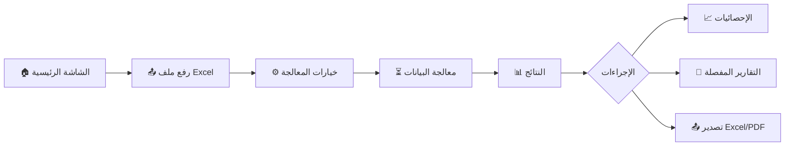

<div align="center">

# 🎯 سجادي - Cut Optimizer Mobile

<p align="center">
  
</p>

**نظام تحسين القص الذكي للسجاد والأقمشة**

[](https://flutter.dev)
[](https://dart.dev)
[](LICENSE)

[العربية](#) | [English](#english-version)

---

</div>

## 📖 نظرة عامة

**سجادي (Cut Optimizer)** هو تطبيق متقدم مصمم خصيصاً لمصانع وورش السجاد والأقمشة لتحسين عمليات القص وتقليل الهادر (الضائع) إلى أدنى مستوى ممكن. يستخدم التطبيق خوارزميات ذكية لترتيب قطع السجاد على النول بأفضل طريقة، مما يوفر الوقت، المال، والموارد.

### 🎯 المشكلة التي يحلها

في صناعة السجاد، يتم إنتاج القطع على "نول" (Loom) بعرض محدد. عندما تأتي طلبات العملاء بأحجام مختلفة، يصبح التخطيط اليدوي لكيفية قص هذه القطع:

- 🕐 مستهلكاً للوقت
- 📉 غير فعال (هدر كبير في المواد)
- ⚠️ عرضة للأخطاء البشرية

**الحل:** تطبيق سجادي يقوم بأتمتة هذه العملية بالكامل باستخدام خوارزميات التحسين الذكية!

---

## ✨ المميزات الرئيسية

### 🧮 تحسين القص الذكي (Smart Optimization)

- خوارزميات متقدمة لتجميع القطع بأفضل طريقة ممكنة
- دعم لأحجام نول متعددة (مرنة حسب إعدادات المصنع)
- مراعاة هوامش القص (Tolerance) والتضييق (Narrowing)
- خيارات ترتيب متعددة (تصاعدي، تنازلي، مخصص)
- نظام اقتراحات ذكي للقطع الصغيرة

### 📊 إدخال وإدارة البيانات

- **استيراد من Excel**: رفع ملفات Excel تحتوي على طلبات العملاء مباشرة
- **واجهة سهلة**: تجربة مستخدم بسيطة وسريعة
- **التحقق التلقائي**: فحص وتحليل البيانات قبل المعالجة
- **دعم الذاكرة**: معالجة الملفات في الذاكرة لتجنب مشاكل الأذونات (Android 13+)

### 📈 تقارير شاملة ودقيقة

- **شاشة النتائج**:

  - ملخص فوري لكفاءة القص ونسبة الهادر
  - مؤشرات أداء واضحة (KPIs)
  - عداد القصات والقطع المستخدمة

- **تفاصيل القصات**:

  - عرض مرئي تفاعلي لكل مجموعة قص
  - جداول تفصيلية بالأبعاد والكميات
  - ألوان مميزة لكل قصة للتمييز السريع

- **المتبقي (Remaining)**:

  - تتبع القطع التي لم يتم قصها
  - عرض الأسباب (عرض زائد، كمية زائدة، إلخ)

- **تحليل الإحصائيات**:
  - رسوم بيانية تفاعلية (مخططات دائرية وخطية)
  - مقارنات بين المساحات المستخدمة والمهدرة
  - نسب الكفاءة والهدر

### 📤 تصدير ومشاركة

- **تصدير Excel متقدم**:
  - 8 أوراق عمل شاملة (ملخص، تفاصيل، قصات، متبقي، إحصائيات، وأكثر)
  - تنسيق احترافي مع ألوان وحدود
  - جاهز للطباعة والمشاركة
- **تصدير PDF**: تقارير جاهزة للطباعة المباشرة
- **المشاركة**: إمكانية مشاركة الملفات عبر التطبيقات الأخرى

### ⚙️ إعدادات مرنة

- **مقاسات النول**: تخصيص عرض النول المتاح
- **الهوامش والتضييق**: ضبط دقيق لمعايير القص
- **المظهر**:
  - تخصيص خلفيات الشاشات (gradients مختلفة)
  - وضع داكن/فاتح
  - دعم كامل للغة العربية (RTL)
- **وحدات القياس**: سم أو متر

### 🎨 تجربة مستخدم عصرية

- تصميم **Glassmorphism** جذاب وحديث
- واجهة **Mobile-First** سلسة ومتجاوبة
- رسوم متحركة ناعمة (Smooth Animations)
- نظام ألوان احترافي:
  - 🟢 أخضر: كفاءة عالية
  - 🟠 برتقالي: تحذيرات
  - 🔴 أحمر: هدر مرتفع أو أخطاء
- خطوط عربية واضحة (Google Fonts)

---

## 🛠️ البنية التقنية

### التقنيات المستخدمة

```yaml
Framework: Flutter 3.10+
Language: Dart 3.10+
State Management: Provider
Architecture: Clean Architecture + Feature-First
```

### الحزم الرئيسية

| الحزمة                     | الاستخدام                   |
| -------------------------- | --------------------------- |
| `syncfusion_flutter_xlsio` | معالجة وتنسيق ملفات Excel   |
| `excel`                    | قراءة ملفات Excel           |
| `file_picker`              | اختيار الملفات من الجهاز    |
| `fl_chart`                 | الرسوم البيانية والإحصائيات |
| `pluto_grid`               | عرض الجداول التفاعلية       |
| `pdf` + `printing`         | إنشاء وطباعة ملفات PDF      |
| `provider`                 | إدارة الحالة                |
| `shared_preferences`       | تخزين الإعدادات             |
| `google_fonts`             | الخطوط العربية              |

### هيكل المشروع

```
lib/
├── core/                      # الوظائف الأساسية
│   ├── constants/            # الثوابت والمسارات
│   ├── services/             # الخدمات العامة
│   ├── state/                # إدارة الحالة
│   └── theme/                # السمات والألوان
├── features/                  # الميزات (Feature-First)
│   ├── home/                 # الشاشة الرئيسية
│   ├── upload/               # رفع الملفات
│   ├── processing/           # خيارات ومعالجة القص
│   ├── results/              # نتائج القص
│   ├── reports/              # التقارير التفصيلية
│   ├── statistics/           # الإحصائيات
│   └── settings/             # الإعدادات
├── models/                    # نماذج البيانات
├── services/                  # الخدمات الخاصة
├── shared/                    # المكونات المشتركة
└── utils/                     # أدوات مساعدة
```

---

## 📦 التثبيت والتشغيل

### المتطلبات الأساسية

قبل البدء، تأكد من تثبيت:

- [Flutter SDK](https://flutter.dev/docs/get-started/install) (3.10.0 أو أحدث)
- [Dart SDK](https://dart.dev/get-dart) (3.10.0 أو أحدث)
- IDE: [Android Studio](https://developer.android.com/studio) أو [VS Code](https://code.visualstudio.com/)
- محاكي Android/iOS أو جهاز حقيقي للاختبار

### خطوات التثبيت

#### 1️⃣ استنساخ المشروع

```bash
git clone https://github.com/yourusername/cut_optimizer_mobile.git
cd cut_optimizer_mobile
```

#### 2️⃣ تثبيت الحزم

```bash
flutter pub get
```

#### 3️⃣ توليد أيقونة التطبيق (اختياري)

```bash
flutter pub run flutter_launcher_icons
```

#### 4️⃣ التشغيل على المحاكي

```bash
# لأجهزة Android
flutter run

# لأجهزة iOS (على macOS فقط)
flutter run -d ios
```

#### 5️⃣ بناء للإنتاج

**Android (APK):**

```bash
flutter build apk --release
```

الملف سيكون في: `build/app/outputs/flutter-apk/app-release.apk`

**Android (App Bundle للـ Play Store):**

```bash
flutter build appbundle --release
```

الملف سيكون في: `build/app/outputs/bundle/release/app-release.aab`

**iOS (على macOS فقط):**

```bash
flutter build ios --release
```

---

## 📱 كيفية الاستخدام

### سير العمل الأساسي



### الخطوات التفصيلية

1. **⚙️ الإعدادات الأولية**

   - اذهب إلى شاشة الإعدادات
   - قم بضبط:
     - عرض النول المتاح لديك (default: 400 سم)
     - الحد الأدنى والأقصى للعرض
     - هامش القص (Tolerance)
     - نسبة التضييق (Narrowing)
   - اختر المظهر المفضل لك

2. **📤 رفع البيانات**

   - من الشاشة الرئيسية، اضغط "رفع ملف Excel"
   - اختر ملف Excel يحتوي على طلبات العملاء
   - **تنسيق الملف المتوقع:**
     ```
     | العرض | الطول | الكمية |
     |-------|-------|--------|
     | 120   | 180   | 5      |
     | 150   | 200   | 3      |
     ```

3. **⚙️ خيارات المعالجة**

   - اختر طريقة الترتيب (تصاعدي/تنازلي/مخصص)
   - اختر نوع المجموعة (سريع/عادي/محسّن)
   - شغّل/أوقف نظام الاقتراحات

4. **📊 استعراض النتائج**

   - ملخص سريع للكفاءة والهدر
   - عدد القصات والقطع المستخدمة
   - نسبة الاستغلال المئوية

5. **📈 التحليل والتقارير**
   - **الإحصائيات**: رسوم بيانية تفاعلية
   - **التقارير**: تفاصيل كل قصة وقطعها
   - **التصدير**: احفظ النتائج بصيغة Excel أو PDF

---

## 🎓 المفاهيم الأساسية

### المصطلحات

| المصطلح                 | الشرح                                           |
| ----------------------- | ----------------------------------------------- |
| **النول (Loom)**        | الماكينة التي يتم عليها إنتاج السجاد بعرض محدد  |
| **القصة (Cut/Group)**   | مجموعة من قطع السجاد يتم قصها معاً من نفس النول |
| **الهادر (Waste)**      | المساحة المهدرة التي لا يتم استخدامها           |
| **التضييق (Narrowing)** | نسبة التقليل في العرض أثناء القص                |
| **Tolerance**           | هامش الخطأ المسموح في القياسات                  |

### كيف يعمل التطبيق؟

1. **قراءة البيانات**: يقرأ التطبيق ملف Excel ويستخرج الأبعاد والكميات
2. **الترتيب**: يرتب القطع حسب العرض (أو الطريقة المختارة)
3. **التجميع**: يجمع القطع ذات العرض المتقارب في قصات
4. **التحسين**: يطبق خوارزميات لتقليل الهدر
5. **الاقتراحات**: يقترح دمج القطع الصغيرة مع الكبيرة
6. **التوليد**: ينتج التقارير والإحصائيات

---

## 🧪 الاختبار

### اختبار الوحدات (Unit Tests)

```bash
flutter test
```

### اختبار التكامل

```bash
flutter drive --target=test_driver/app.dart
```

### اختبار الأداء

```bash
flutter run --profile
```

---

## 🤝 المساهمة

نرحب بمساهماتكم! إذا كنت ترغب في المساهمة:

1. Fork المشروع
2. أنشئ branch جديد (`git checkout -b feature/AmazingFeature`)
3. Commit التغييرات (`git commit -m 'Add some AmazingFeature'`)
4. Push إلى Branch (`git push origin feature/AmazingFeature`)
5. افتح Pull Request

### معايير الكود

- اتبع [Dart Style Guide](https://dart.dev/guides/language/effective-dart/style)
- اكتب تعليقات واضحة بالعربية أو الإنجليزية
- أضف اختبارات للميزات الجديدة

---

## 🐛 الإبلاغ عن المشاكل

إذا واجهت أي مشكلة، يرجى فتح [Issue](https://github.com/yourusername/cut_optimizer_mobile/issues) مع:

- وصف واضح للمشكلة
- خطوات إعادة إنتاج المشكلة
- لقطات شاشة إن أمكن
- إصدار التطبيق ونظام التشغيل

---

## 📄 الترخيص

هذا المشروع مملوك لـ [اسم الشركة/المطور] وهو **خاص** (Private).

```
Copyright © 2025 Assem Habib
All rights reserved.
```

---

## 👨‍💻 المطور

**تم التطوير بواسطة:** Assem Habib

📧 **للتواصل:** [your.email@example.com](mailto:your.email@example.com)

🌐 **الموقع الإلكتروني:** [www.yourwebsite.com](https://www.yourwebsite.com)

---

## 🙏 شكر وتقدير

- فريق Flutter لهذا الإطار الرائع
- مكتبة Syncfusion للتعامل المتقدم مع Excel
- المجتمع العربي للمطورين

---

## 📱 لقطات الشاشة

<div align="center">

| الشاشة الرئيسية               | رفع الملفات                       | النتائج                             |
| ----------------------------- | --------------------------------- | ----------------------------------- |
|  |  |  |

| الإحصائيات                           | التقارير                            | الإعدادات                             |
| ------------------------------------ | ----------------------------------- | ------------------------------------- |
|  |  |  |

</div>

---

## 🗺️ خارطة الطريق (Roadmap)

- [ ] دعم حفظ المشاريع محلياً
- [ ] تصدير إلى صيغ إضافية (CSV، JSON)
- [ ] نسخة ويب (Web Version)
- [ ] نظام المستخدمين والصلاحيات
- [ ] تكامل مع أنظمة ERP
- [ ] دعم أنواع أقمشة إضافية

---

<div align="center">

**صُنع بـ ❤️ للنهوض بصناعة السجاد**

⭐ إذا أعجبك المشروع، لا تنسى وضع نجمة!

</div>

---

# English Version

<div align="center">

## 🎯 Sajadi - Cut Optimizer Mobile

**Smart Cutting Optimization System for Carpets & Fabrics**

</div>

### Overview

**Sajadi (Cut Optimizer)** is an advanced mobile application designed specifically for carpet and fabric factories to optimize cutting operations and minimize waste to the lowest possible level. The app uses intelligent algorithms to arrange carpet pieces on the loom in the most efficient way, saving time, money, and resources.

### Key Features

- 🧮 **Smart Cut Optimization** with advanced algorithms
- 📊 **Easy Data Input** via Excel import
- 📈 **Comprehensive Reports** with detailed analytics
- 📤 **Export & Share** results in Excel/PDF formats
- ⚙️ **Flexible Settings** for customization
- 🎨 **Modern UI/UX** with Glassmorphism design

### Quick Start

```bash
# Clone the repository
git clone https://github.com/yourusername/cut_optimizer_mobile.git

# Navigate to project directory
cd cut_optimizer_mobile

# Install dependencies
flutter pub get

# Run the app
flutter run
```

### Tech Stack

- **Framework:** Flutter 3.10+
- **Language:** Dart 3.10+
- **State Management:** Provider
- **Architecture:** Clean Architecture

### Building for Production

```bash
# Android APK
flutter build apk --release

# Android App Bundle
flutter build appbundle --release

# iOS (macOS only)
flutter build ios --release
```

### License

This project is **private** and proprietary.

---

<div align="center">

**Made with ❤️ for the Carpet Industry**

</div>
